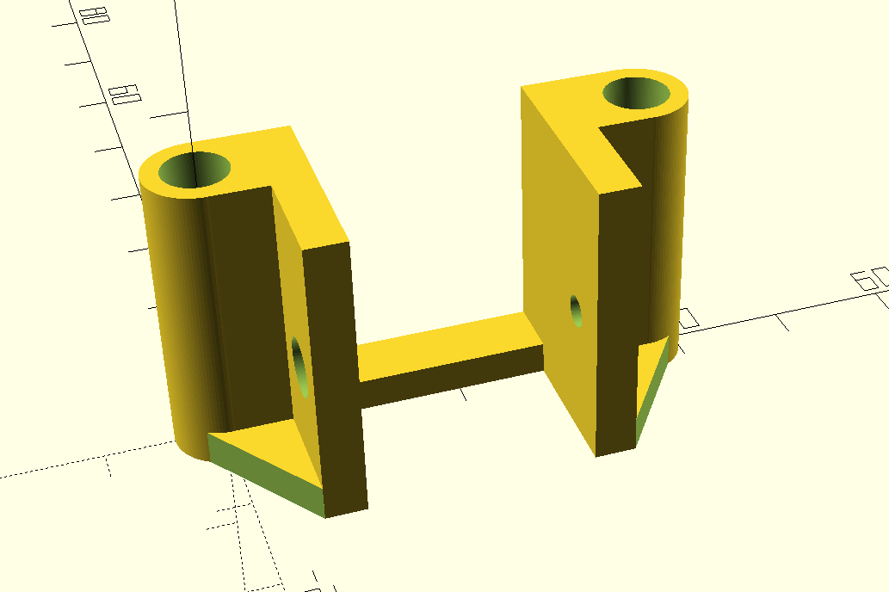
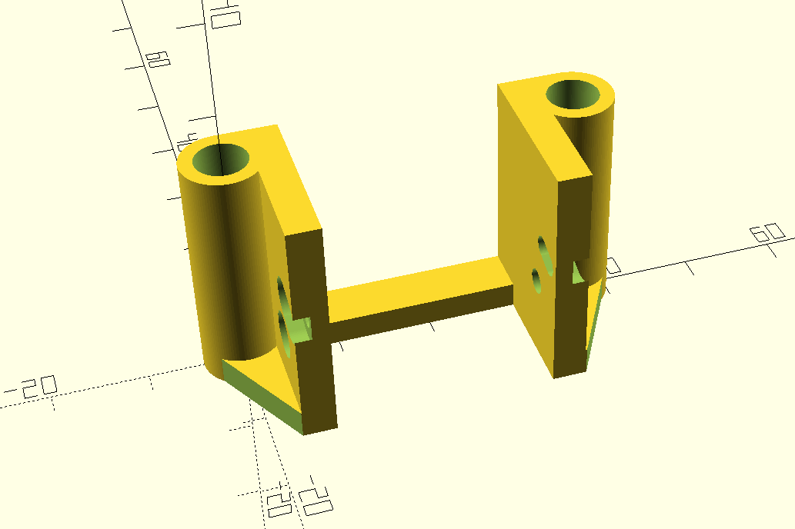

# Camera(mini and micro) mounts models for axisflying 10-inch lite. 
## Mounts have NOT been tested yet in real flight to catch any additional vibration or similar. Source files can be modified/viewed with OpenSCAD.
```/stl``` - 3d print models ready to be fed for slicing

```/images``` - how the mounts look


## Micro camera mount




## Mini camera mount


